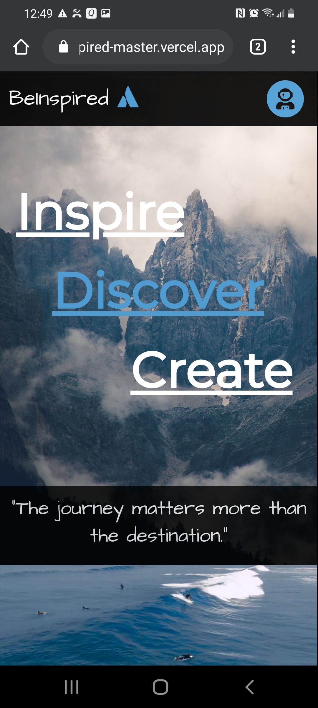
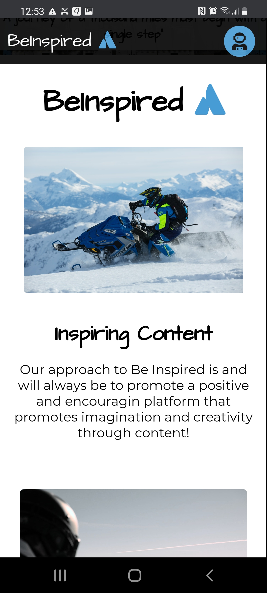
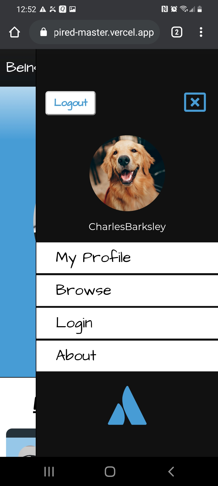
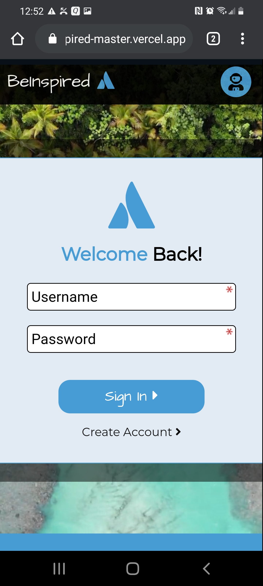
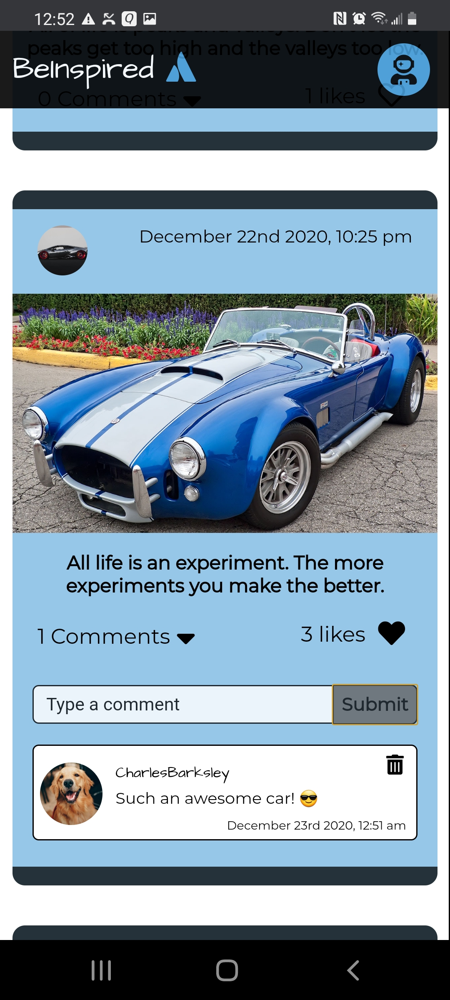
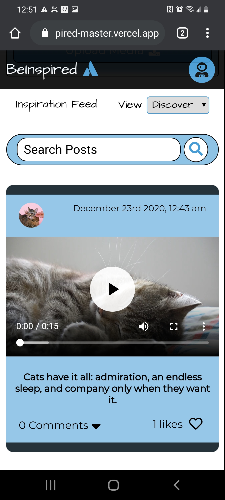
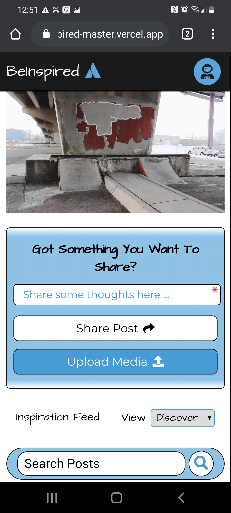

<h1>Be-Inspired App</h1>

  
Aiming to create a social media platform geared towards promoting a positive and motivating experience Be-Inspired allows users to post and explore inspiring content uploaded by other users!

  
## PERN Stack

Be-Inspired was built using the PERN stack as the foundation of the application. The application includes JWT authentication for login and access, PostGres for storing and retrieving user uploads and posts, and all media is handled using Cloudinary's Upload Widget and Cloud storage. Designed with a desktop first approach the application includes a responsive design that looks great across all media platforms.

  
  

## Features

### Login Authentication

Using JWT, bcrypt, & form data users are able to create profiles, log in & out, and are granted limited access within the application before being authenticated.

  
  

### Image & Video Uploads

Users have the ability to upload and view images and videos. Using Cloudinary's upload widget users are able to crop, previews, and store their uploaded media.

  
  

 
### User Profiles

Users are able to create profiles that show off who they are, their interests, and photos of themselves and their activities. Users are able to filter, view, and delete uploaded posts for full control of the content they deliver.

  
  

### Test it out!

Below is a test account that will allow you to view and experience the app in action!

Username: TestUser1 / Password: Testing123!

( Please do not delete the test accounts )

## Additional Information

This application was designed and developed as part of a full-stack project that required developing an application using the PERN stack. As my second full-stack project I decided to construct a social media platform that would allow me to gain valuable experience in the overall design and implementation of a more complex database / backend. Accomplishing just that I really enjoyed creating this application, giving me the opportunity to create something I am passionate about!
  

