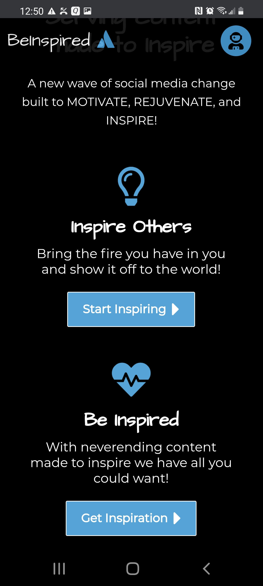

<h1>Full Stack Developer</h1>

  
Aiming to create a social media platform geared towards promoting a positive and motivating experience Be-Inspired allows users to post and explore inspiring content uploaded by other users!

  
## PERN Stack

Be-Inspired was built using the PERN stack as the foundation of the application. The application includes JWT authentication for login and access, PostGres for storing and retrieving user uploads and posts, and all media is handled using Cloudinary's Upload Widget and Cloud storage. Designed with a desktop first approach the application includes a responsive design that looks great across all media platforms.

  
  

## Features

### Login Authentication

Using JWT, bcrypt, & form data users are able to create profiles, log in & out, and are granted limited access within the application before being authenticated.

  
  

